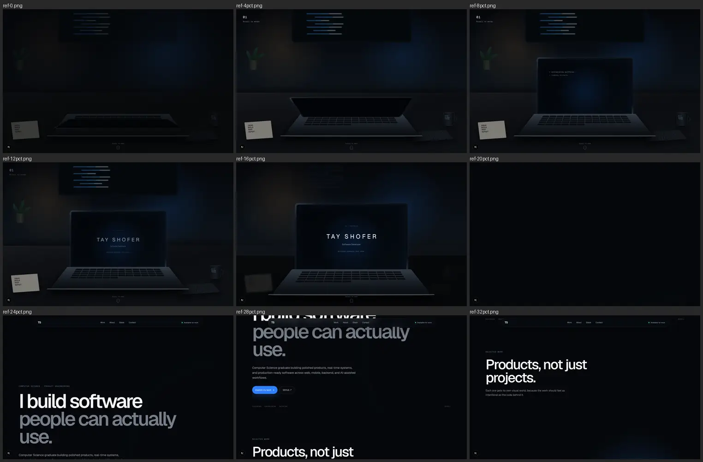
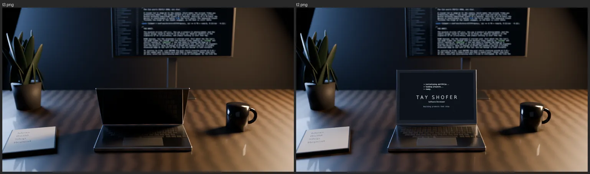
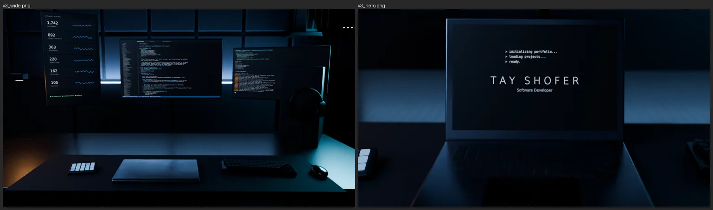
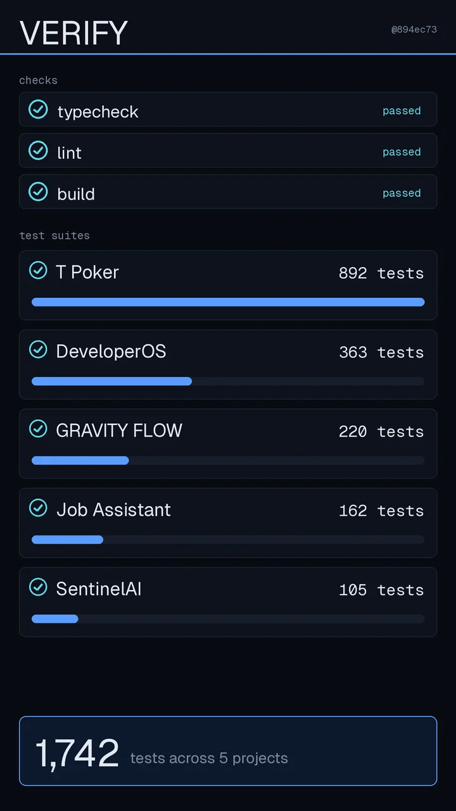
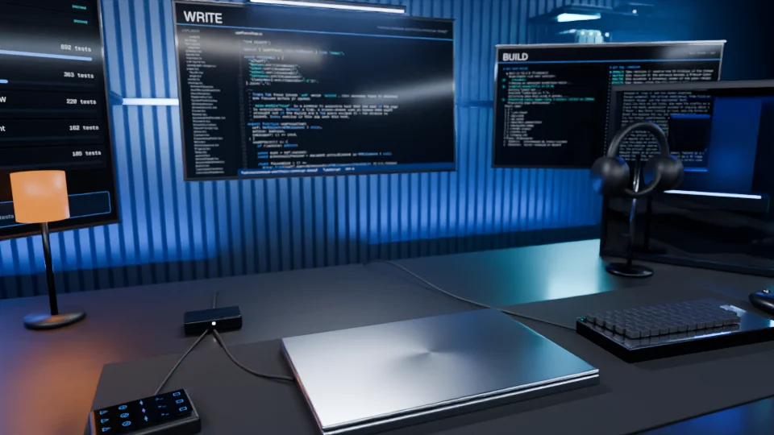
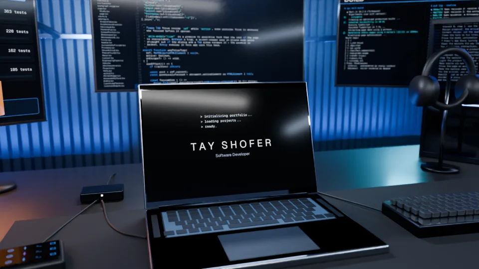
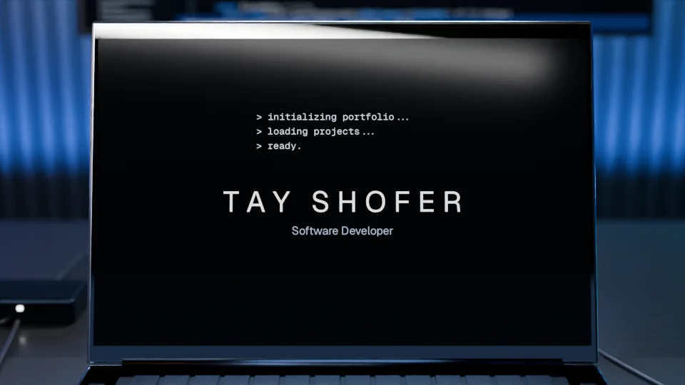

# Cinematic Laptop Redesign — Design Spec

**Date:** 2026-09-25
**Branch:** `feature/premium-portfolio-redesign-1mqmgf` (continues the August work; nothing is reset)
**Status:** Awaiting your approval, revision 2: the entrance art direction is now a Premium Cyber Developer Studio (§4.6). No production code has been written for this spec.
**Supersedes:** the arrival proposal (`2026-08-05-arrival-experience-design.md`, Concept B, the dual-monitor workspace) and the page composition of `2026-08-04-premium-portfolio-redesign-design.md`, wherever they conflict with this document. Their verified content, infrastructure and accessibility work stay.

Evidence referenced below lives in `docs/superpowers/specs/assets/` and `design/references/`.

---

## 1. Understanding

### What you asked for (stated)

- A cinematic, product-launch-quality portfolio for **Tay Shofer — Software Developer** that is itself evidence of frontend and engineering ability.
- An opening scene in which **you cause** a premium laptop on a real-looking desk to wake up. The screen then becomes the website, with no fade to black.
- Scroll story, as guidance: darkness lifts (0–12%) → lid opens (12–38%) → screen powers on and boots (38–53%) → identity (53–68%) → camera moves to the screen (68–88%) → the screen becomes the site (88–100%).
- After that, product storytelling: each important project gets its own visual world for several seconds of scroll. T Poker as a mobile product presentation, SentinelAI as a real-time security product, DeveloperOS as a workspace that assembles, and GRAVITY FLOW as playful and physical. Job Assistant and Orders & Delivery stay.
- Approved copy: *"I build software / people can actually use."*, *"Engineer by training. / Builder by nature."*, *"Think. Build. Ship."*, *"Let's build / something great."*
- Dark and restrained: obsidian, soft off-white, controlled ice-blue, a hint of warm desk light. No purple gradients, no neon, no glass everywhere, no card farms. This applies to the site UI; the rendered entrance follows §4.6's hue lock.
- **Entrance art direction, revised 2026-09-25: a Premium Cyber Developer Studio.**
  - Apple-level product cinematography × a serious software-engineering workstation × a high-end battlestation.
  - It must read as software engineering before any copy, and be recruiter-safe, never a gaming room.
  - Roughly 85% dark and cool, 10% screen light, 5% warm practical. Restrained ice, cyan and deep-blue accents; no rainbow RGB.
  - The laptop dominates more with every beat: room → workstation → laptop → screen → Tay Shofer → website.
  - The background screens show real repository content. See §4.6.
- The concept image, `design/references/cinematic-laptop-concept.webp` (identical to the package's `docs/portfolio-concept.png`), fixes the story beats, the closed-to-open laptop hero, and the palette. **The environment follows the art-direction revision (§4.6), which supersedes the concept wherever they differ.**
- The repository stays the source of truth for facts, links, SEO, API, accessibility and configuration.
- The reference package on `reference/premium-redesign-package` is reference material only.
- Real verification: typecheck, lint, tests, build, and browser screenshots at 1440×900, 1366×768, 768 and 390×844.

### What I am assuming (correct me at review)

1. **The September direction replaces the August arrival.** The branch's last work was Concept B, a dual-monitor workspace with its screen already on. Your concept image and brief describe a closed laptop that opens and boots, so Concept B is retired. Its *pipeline idea* is kept and upgraded: render offline, export screen corners, and map live DOM onto the render.
2. **The August section compositions are retired, but their facts stay.** That means the instrument-panel page, the topology board, the pipeline run and the arc carousel go, while every fact-checked number and caveat in `data/*.ts` stays.
3. **Copy that the new direction replaces:** "I build production software that solves real problems.", "Everything here runs. Come in and check." and "You've seen it run." give way to the approved lines above.
4. **The light theme keeps working** because the brief says to preserve theme behaviour. The site is designed dark-first, and the rendered entrance is always dark. The hero *follows the theme*, and it enters through a dark screen:
   - While the hero is "inside" the laptop, its background is `--screen`, which is dark in both themes. The boot log and identity always sit on it, as a terminal does.
   - During the portal (0.88–1.00), `--screen` cross-fades to `--bg`. In the dark theme that is a no-op. In the light theme the lights come up as you step through the screen.
   - The render's baked backlight spill assumes a dark screen, which matches, because the brightening happens only once the desk has left frame.
   - There is no dark-to-light seam at Work, and no forced-dark token scope.

---

## 2. What the reference package gives us

I fetched it read-only (`git archive`, no checkout or merge), ran it locally, and captured its intro across the full scroll range.



| Area | Verdict | Why |
|---|---|---|
| Scroll storyboard and percentages (`ANIMATION_SPEC.md`) | **Port** (refined) | It matches your brief. Its numbers are the starting point for §4.2. |
| Section order and approved copy (Hero, Work, About, Stack, Think/Build/Ship, Contact, Footer) | **Port** | It matches the concept image. |
| Nav hidden during the intro, then "Available for work" | **Port** (rewritten) | The idea is right. Its trigger is a magic `3.2 × innerHeight`; ours listens to the entrance's actual progress. |
| Per-project "kinds" (phones / monitor / windows / orbit / terminal / flow) | **Port the idea, rebuild the worlds** | Right structure. The visuals render small and dim, and the scenes don't take over the viewport. |
| Bento stack with a pointer-follow light, Think/Build/Ship, planet-horizon contact | **Port** (restyled onto our tokens) | They match the concept. |
| Mobile gets a shorter intro timeline; reduced motion starts with the laptop open | **Port** (extended to the in-app toggle) | Its `useReducedMotion` ignores the site's own accessibility toggle. |
| CSS/DOM pseudo-3D laptop (`IntroScene.tsx`) | **Do not port** | See §4.1. On screen it reads as an illustration, and the August history already spent four CSS passes trying to get past that. |
| Portal = a `portal-veil` fading to solid `#05070a` | **Do not port** | It is exactly the "cheap fade-to-black followed by a normal webpage" the brief rules out. At 20% scroll the whole viewport goes black. |
| GSAP + ScrollTrigger | **Do not add** | See §7. It would be a second animation library doing Framer Motion's existing job. |
| `AmbientCanvas` particle field | **Drop** | Its `requestAnimationFrame` loop runs forever at 60 fps, including while offscreen. The atmosphere it adds is carried here by the render and the static horizon light. A page-wide particle canvas would be a permanent cost for very little. |
| `data/*.ts` in the package | **Do not port**: it contradicts the repo in ways that are *factually wrong* (see below) | The repo was fact-checked against each project's own repository in August. |
| `scripts/sync-assets.mjs` | **Not needed** | The real screenshots are already in `public/projects/**` as WebP. The package's PNGs are identical placeholders. |

**Factual errors in the package that must not reach production:**

| Package says | Repository truth |
|---|---|
| T Poker live URL `poker-home-games-three.vercel.app` | `https://app.tpoker.app/`, plus the live App Store listing |
| GRAVITY FLOW "Live product" → `taysh123.github.io/Gravity-Game` | Removed in August: the link served a privacy policy. The game is `v1.0.0-rc` and Android-only |
| Orders & Delivery: "Node.js, REST, SQL, React", "state transitions" | 100% Java, JavaFX, raw TCP, a flat-file DAO. It is university coursework and says so |
| SentinelAI "AI-assisted" | The analysis mode is a deterministic template provider; no model is called |
| Job Assistant terminal: "1,077 roles collected / 103 matched" | 287 jobs collected over 61 runs. Crons are disabled; it runs as a Docker service |
| About: "6+ Shipped projects" | Not supportable: two projects run locally and one is coursework |

**Existing repo inconsistencies, found while cross-checking. They are fixed toward the facts the repo itself states:**

1. **The C++ evidence line.** `data/skills.ts`'s `Languages` evidence line says "C++ and C# carry SentinelAI and T Poker", but neither project contains C++. It is rewritten to what the data supports: C# carries both backends, TypeScript the clients, and Python DeveloperOS and Job Assistant.
   - C and C++ stay in the language list. They are Tay's foundation, and the About copy says so.
   - The new Stack copy therefore must not claim "everything here ships in production", as the old Toolkit intro did.
2. **The GRAVITY FLOW iOS listing.** GRAVITY FLOW's `stores` lists iOS as "soon", while its honest note says "Android-only — there is no iOS build". The iOS entry is removed.
3. **The "7 languages in shipped code" stat.** It counted languages that are not in shipped code. It retires with the old hero stat strip and from the social card.

---

## 3. Design system

### 3.1 Research (UI UX Pro Max)

I ran `--design-system` with *"premium developer portfolio cinematic product-launch dark restrained immersive technical minimal spacious"*, plus style, colour, typography, landing, UX, `--stack nextjs` and `--stack threejs` searches.

| Recommendation | Adopted? |
|---|---|
| Style **Parallax Storytelling** (scroll-driven chapters, sticky sections, a mobile alternative, a skip option, a reduced-motion fallback) | **Yes.** It is the page's structure. |
| Style **Dark Mode (OLED)**: deep near-black, high-contrast text, minimal glow | **Yes**, as the base. |
| Accent **run green `#22C55E`** (the Developer Tool palette) | **No.** You approved ice-blue. Green is kept only for the "available" status dot, always paired with text. |
| Typography **Inter** | **No**, but only on grounds of redundancy. Geist is already the brand face, loaded via `next/font`, and occupies the same neo-grotesk register. Switching fonts buys nothing. |
| UX: reduced motion (High), no forced scroll effects (High), 1–2 animated elements per view (High), no horizontal scroll (High), ease-out in / ease-in out | **Yes**, all enforced (§7, §8). |
| Next.js: `next/dynamic` for heavy parts, `next/font`, reserve space (CLS), an LCP image hint | **Yes.** In Next 16 the hint is `preload`, not the deprecated `priority`. |
| three.js: DPR cap at 2, dispose resources, render on demand | Moot. The entrance ships **no WebGL** (§4.1). |
| Pre-delivery: contrast ≥ 4.5:1, focus rings, 44 px targets, 375 px and landscape checks, both themes | **Yes**, in the verification plan (§10). |

No persisted `design-system/MASTER.md` existed. I have not generated one, because this spec's tokens are the design system and a second, generated source of truth would drift. I will persist one with `--persist` if you want it.

### 3.2 Tokens

The token architecture stays as August built it: semantic CSS variables on `:root` and `[data-theme="light"]`, surfaced through Tailwind's `@theme inline`, with no literals in components. The **values** change:

| Role | Dark (default) | Notes |
|---|---|---|
| `--bg` | `#05070a` obsidian | Replaces the violet-tinted `#07070f` |
| `--bg-raised` | `#0a0e14` | Section and card base |
| `--fg` | `#f2f4f8` soft off-white | ≥ 17:1 |
| `--fg-muted` | `#9aa3b2` | ≥ 7:1 |
| `--fg-subtle` | `#7b8597` | ≥ 5:1. Labels are ~11 px, so held above 4.5 |
| `--accent` | `#5b9cff` ice-blue | Text and link use, ≥ 7:1 on `--bg` |
| `--accent-solid` | `#1d6ef5` | Primary button fill. White text on it is ≥ 4.5:1 |
| `--light-cool` | `rgba(91,156,255,.14)` | Atmosphere only: screen glow, horizon |
| `--light-warm` | `rgba(255,180,107,.10)` | Atmosphere only: the desk-lamp echo. Never text |
| `--line` / `--line-strong` | `rgba(255,255,255,.08 / .14)` | Hairlines |
| `--status-live` | `#4ade80` | Always with a text label |
| `--screen` | `#05070a` in **both** themes | The laptop screen's black; the hero's background while it is inside the laptop (§1, assumption 4) |

**Old tokens map to new ones:**

| Old | New |
|---|---|
| `--surface-0` | `--bg` |
| `--surface-1` and `--surface-2` | `--bg-raised` and one low-alpha tint |
| `--surface-3` | Kept, for overlays |
| `--border-*` | `--line`, `--line-strong` |

- `--status-wip` and `--status-idle` stay, because `Tag` uses them.
- The high-contrast overrides (`globals.css`, `[data-high-contrast]`) are rewritten against the new set. They currently reference the violet `--glow`.
- `lib/tokens.ts`, the mirror read by the social card and `themeColor`, is updated in the same change.
- **Project accents** (`projectAccent`: amber, blue, violet, teal) are retuned less saturated. The violet `#b47cff` becomes a cool periwinkle. They are used *only* as light inside each project's own world, never for UI text or buttons.

**Retired:** `--glow` and `--glow-strong` (violet), the panel-fill gradients, the aurora field, `--device-*` (the CSS laptop) and `--desk-*`. The light theme gets a matching set (paper `#f5f6f8`, ink `#0b0e14`, accent `#1459d9`), checked for contrast independently.

**Type:** Geist Sans 400/500/600 and Geist Mono 500 for labels.

| Level | Size | Weight | Tracking |
|---|---|---|---|
| Hero display | `clamp(3rem, 7.2vw, 6.75rem)` | 600 | −0.045em |
| Section titles | `clamp(2.25rem, 5vw, 4.5rem)` | 600 | — |
| Lead | `clamp(1.125rem, 1.5vw, 1.3125rem)` | — | — |
| Body | 17 px, line-height 1.6, ≤ 62ch | — | — |
| Labels | 11 px mono, uppercase | — | +0.16em |

**Space and layout:** content shell `min(1240px, 100vw − 2×gutter)` and gutter `clamp(20px, 4vw, 40px)`. Section rhythm is `clamp(7rem, 14vh, 12rem)`, which gives low density and large negative space. Radius runs 10 / 16 / 24 / pill. There is one elevation shadow for floating objects (phones, windows) and none on text blocks.

**Motion tokens:** `--ease-out: cubic-bezier(.16,1,.3,1)`, `--ease-in-out: cubic-bezier(.65,0,.35,1)`, and durations 180 / 320 / 560 ms. Reveals use scale .96 → 1, y 24 px → 0 and blur 6 px → 0. Parallax distance is ≤ 48 px. Stagger is 60 ms, used only for lists.

---

## 4. The entrance

### 4.1 How to build it: three approaches, measured

| | **A. CSS/DOM pseudo-3D** (the package; also the August `Workstation.tsx`) | **B. Real-time three.js** (the August `/gl-spike`, `design/render/scene.ts`) | **C. Path-traced frame sequence + live DOM screen** ★ |
|---|---|---|---|
| Realism | Illustration. Measured twice: four August passes, and the package screenshot above | "Clean 3D mock-up". Rasterised lighting has no global illumination, soft bounce or depth of field ([August render](assets/2026-09-25-august-render.webp)) | Photographic. A Cycles path tracer gives real bounce light, soft shadows, reflections on the glass and keys, and depth of field |
| Lid reflections that evolve with the angle (brief) | Faked with gradients | Yes | Yes, physically |
| Runtime cost | Low | +~150 KB gzip JS, a GPU context, and per-device shader and lighting risk | **No WebGL, no new JS library.** A 2D canvas draws one or two images per scroll change |
| Payload | ~0 | ~150 KB JS | Frames, projected for the richer studio (§4.6) at 15–25 KB per 960×540 AVIF frame: ~1.9–2.5 MB at the 1280 tier and ~3.5–4.6 MB at the 1920 tier (desktop), ~0.95–1.2 MB for the portrait plan (§4.4: 31 frames at the 720 tier). The 1920 tier may exceed its budget; the §4.7 levers close that gap. Fetched after first paint |
| Screen → website | Easy (it is DOM) | Hard (DOM projected onto a moving 3D quad) | Easy and exact: every frame carries its projected screen corners, and the DOM rides them via `matrix3d` |
| Failure mode | Looks cheap | Looks like a game asset, or janks on weak GPUs | A poster instead of motion, if frames fail to load |

**Recommendation: C.** It is the only option that can reach the concept image, and it is also the lightest at runtime. This is how Apple ships product reveals.

**Spike evidence (throwaway):** the official Blender 5.0 Python module (`bpy`, pip wheel, OpenImageDenoise included) runs in this container. Two quick iterations of a procedural desk rendered in **~35 s per frame at 960×540, 48 samples, on 4 CPU cores**:



That was ten minutes of scene work. It proved the *physics* of the look: practical light, a code monitor falling out of focus, depth of field, and a lid that reflects the keyboard. None of that is reachable with A or B. As art direction, though, it was a lifestyle desk: too restrained, with the laptop too small.

A second prototype, built in the revised direction (§4.6), renders the full studio inventory in **~34 s per frame at 960×540 and 40 samples**. The richness itself is affordable:



It is a **prototype, not a key frame**. §4.6 lists its failures and the fix for each.

### 4.2 Scroll story (desktop, landscape)

The entrance is a pinned stage inside a **400svh** container, which gives 300svh of travel. Progress `p` runs 0 → 1 across that travel.

The story narrows as you scroll: **room → workstation → laptop → screen → Tay Shofer → website**. The "Journey" column maps each beat onto that. The "Frames" column says whether a beat is rendered frames, or 2D/DOM work over a rendered frame.

| `p` | Beat | Journey | Frames | What moves |
|---|---|---|---|---|
| 0.00 | **Arrival** | Room | K0, 1 rendered frame (the poster) | A near-black veil over the studio (§4.6). The closed silver laptop carries a chamfer hairline and a soft reflection of the code display. "01 — Scroll to begin" in mono, top left. |
| 0.00–0.12 | **Darkness lifts** | Room | 2D over K0 | The exposure veil goes 1 → 0 (ease-out), and a stage zoom goes 1.00 → 1.03 and is then **held for the rest of the sequence**. FramePlayer applies the zoom in its cover fit, and screenSurface applies it to every quad, so the first lid frame does not jump. "TAY SHOFER / Software Developer" fades in, letterspaced, in the title quiet zone above the laptop (§4.6), never over the code display. |
| 0.12–0.38 | **Lid opens** | Workstation → laptop | 36 rendered | ~5 still frames while the lid cracks and the key backlight spills a thin ice line across the mat (concept frame 02). The room title fades out over 0.12–0.17, before the crane starts. Then the camera cranes down and in (30 → 40 mm) as the hinge goes 0° → 108°. The laptop grows from ≈ 27% to ≈ 46% of the width as the monitor arc falls behind it. The sweep travels down the black glass and the lid's shadow crosses the mat. "02 — Scroll to open". |
| 0.38–0.53 | **Power-on** | Laptop → screen | 2D: cross-fade K1-off → K1-on (one render, via light groups) | Only the laptop wakes. Its spill onto the keys and mat is in the render; the room does not change. The DOM screen wakes. It is hidden until here, so the rendered glass reflections show through the lid move and at K1-off. First the backlight, then the restrained boot log (`> initializing portfolio…` / `> loading projects…` / `> ready.`). |
| 0.53–0.68 | **Identity** | Tay Shofer | 2D: K1-on held, with the DOM on it | On the screen, the log gives way to **TAY SHOFER / Software Developer / Building products that ship.** "03 — Welcome". The laptop's framing is held so the identity is legible. |
| 0.68–0.88 | **Camera** | Screen fills the view | 28 rendered | The push, in two phases: first a square-up onto the screen normal, then a dolly along it (40 → 50 mm; the aperture opens only after the square-up). The room dims to ×0.6 and the warm light goes to 0. Monitors, tower and homelab dissolve into bokeh and leave the frame. The screen surface rides the projected corners, and eases to identity once the screen covers the viewport (§4.3). |
| 0.88–1.00 | **Portal** | Website | DOM over K2 (static) | K2 is perpendicular to the screen and overscans the frame, so the bezel has already gone. The surface is at identity. This phase is content and colour continuity: the identity becomes the hero (§4.3). The nav fades in over 0.96–1.00, and the pin releases at 1.00. |

The percentages are your guidance. They will be tuned against the real frames in the browser, not by argument. A visible **Skip intro** control, and the skip link, jump straight to `p = 1` and move focus to the `h1`. Keyboard focus landing anywhere inside the hero while `p < 1` does the same, instantly, so focus can never rest on a control that is still inside the laptop.

### 4.3 The portal: the screen *is* the hero

There is no duplicate hero and no cross-fade to a separate page:

- **The hero section is the screen surface.** The real `<section id="hero">` with the real `<h1>` is mounted inside the pinned stage. While the screen is visible inside the laptop, its transform is the homography that maps it onto the screen quad of the frame being drawn. By K2 (p 0.88) that transform is exactly the identity, so when the pin releases the thing on screen simply *is* the hero and scrolls away like any section.
- **Aspect ratio and hand-off:** the laptop screen is 16:10 and viewports are not.
  - **Landscape entrance (aspect ≥ 0.9):**
    - The surface is laid out at viewport size and extended to the 16:10 rectangle that *circumscribes* the viewport. The extra bands are `--screen`, the same black as the panel, so they are invisible.
    - The homography maps that rectangle onto the screen quad.
    - When the rendered quad first contains the viewport during the late push, the content scale is therefore already ≈ 1.00. The bezel leaves the viewport in rendered frames, and the transform eases to exact identity by K2 (p 0.88), with no scale "bounce".
    - 0.88–1.00 is content and colour continuity only.
  - **Portrait entrance (aspect < 0.9):**
    - A landscape screen can't contain a portrait viewport, so the surface maps a centred band of the viewport onto the quad.
    - At P2 the quad spans the full width with ≥ 3% overscan. Over 0.88–0.96, on the static P2 frame, the DOM band **opens vertically** to full height, covering the rendered bezel and desk above and below it, and reaches identity at 0.96.
    - 0.96–1.00 is continuity only.
  - **Guarantee:** for p ≥ 0.88 in landscape, and p ≥ 0.96 in portrait, the surface is at identity **whatever frame is drawn**. Missing push frames can never strand the hero inside the laptop.
  - You see the screen *expand*, not a letterbox.
- **Content continuity:** "TAY SHOFER" glides and shrinks into the hero's name line and "Software Developer" merges into it. "Building products that ship." gives way to the headline *I build software / people can actually use.*, which rises in with a mask reveal, followed by the supporting line and CTAs. Every step is transform or opacity.
- **Background continuity:** the screen's black is `--screen`, which cross-fades to `--bg` during the portal. That is a no-op in the dark theme (§1, assumption 4). The bezel and desk leave frame because they are *outside* the screen, so nothing fades to black.
- **Glass:** a faint reflection gradient sits over the surface while it is "inside" the laptop and fades to 0 as it reaches the viewport.

### 4.4 Mobile and portrait: its own composition

**Which entrance each device class gets:**

| Viewport | Frames | Container |
|---|---|---|
| Aspect < 0.9 (phones and tablets in portrait) | Portrait set | 260svh |
| Aspect ≥ 0.9 and height ≥ 500 px (laptops, desktops, tablets in landscape) | Landscape set (1280 tier by default; 1920 tier at DPR ≥ 1.5 and width ≥ 1280) | 400svh |
| Aspect ≥ 0.9 and height < 500 px (phones in landscape) | Landscape set, 1280 tier | 260svh |

The portrait composition:

- A separate **portrait render**, 1080×1920 with vertical sensor fit, at **260svh**. It follows the same journey (§4.6):
  - **P0 room:** 32 mm. The laptop is ≈ 45% of the width in the lower third, with the whole code display above it.
  - **P1 laptop:** 38 mm, ≈ 85% of the width.
  - **P2 screen:** 40 mm, on the screen normal, ≥ 103% of the width.
  - Out-of-frame props stay in the scene, invisible to the camera, so their light and reflections remain.
- Fewer frames, to fit the 1.2 MB budget: P0, **16 lid**, 1 wake render (giving the off and on frames), **12 push**, 31 frames in all. Cross-fades cover the wider steps. The same beats, compressed. There is no room title, because the name appears on the screen instead.
- A **720×1280 delivery tier**, encoded from the 1080×1920 master. The DOM screen stays crisp at any density; the frames are mostly depth of field.
- The portal expands a landscape screen into a portrait viewport. The 16:10 band opens vertically into the full screen, which reads as the screen unfolding, and it is designed rather than accidental.
- Native touch scroll only: Lenis already leaves touch alone, and there is no scroll-jacking.

### 4.5 Reduced motion, no JavaScript and failure

The **layout is decided in CSS at first paint**, which is what keeps CLS at 0. It is the same DOM in every mode, and CSS switches the stage between *pinned* and *static*:

- `prefers-reduced-motion: reduce`, the in-app toggle (`[data-reduced-motion="true"]`, already server-rendered from the cookie) or `<noscript>` all do the same thing. The container is **not pinned**: one static **still** image, followed by the hero as a normal section.
  - The still is the K1 framing (§4.6) with the screen awake and the identity baked into the screen texture, because no JavaScript places DOM on it in this mode.
  - The hero surface drops out of its absolute, transformed position into normal flow.
  - There is no frame sequence, dolly or parallax, and JS applies no transforms in this mode.
  - The nav is visible from the first paint. The floating palette, chat and accessibility buttons are client-only, so without JS they don't exist; with JS they appear immediately.
- **The poster and the still** exist per framing (landscape and portrait). They are `<picture>` elements (AVIF plus a JPEG fallback) so that every browser can show them. **Sequence frames** are AVIF only.
- **If a frame will not decode, the pinned layout stays,** and the entrance shows the poster and still inside it. It never unpins after first paint, which would shift the layout and jump the scroll position.
- **Frames missing or late**, whether on a cold load or after a failure, never produce a mismatch:
  - The DOM surface always takes its quad from **the frame actually drawn**, never from the frame that "should" be there.
  - Load order is poster → still → K2 (P2 in portrait) → sparse lid frames → fill → push. The Save-Data sparse set always includes K1-on and K2.
  - Frames whose screen faces away from the camera (the closed lid and the crack frames) have a **null quad** in the manifest. The surface stays hidden until power-on at 0.38 in any case.
  - The still (the K1 framing) stands in only for `p ≥ 0.38`. A missing lid frame falls back to the nearest decoded lid frame, then to the poster, because the lid move travels too far for the still to substitute.
  - It degrades to "less motion", never to "broken".
- **Save-Data or 2G/3G:** only every fourth frame is fetched, and cross-fades cover the gaps.

### 4.6 Art direction: Premium Cyber Developer Studio

**Brief (your 2026-09-25 revision):** Apple-level product cinematography, a serious software-engineering workstation and a high-end battlestation in one room. A viewer should read "this person builds software" before any copy, and never "gaming YouTuber".

This replaces the earlier direction ("dark wood desk, one warm light right, plant, mug, no RGB"). The architecture does not change: the Cycles frame sequence, the live DOM screen, and the portal with no fade to black (§4.1, §4.3, §4.8).

*How this section was made:*
- Three independent treatments were written: a product cinematographer, a senior engineer who runs a real battlestation, and a procedural technical artist.
- Three judges scored them: a recruiter lens, an art-director lens and a technical-director lens. Totals: cinematographer 179, engineer 172, technical artist 165.
- The synthesis starts from the winner and grafts in the best ideas of the other two.
- A completeness critic checked it against every line of your brief, and its fixes are applied.

**Governing idea: the room is lit by the work.** Every light a viewer can name comes from a machine doing engineering:
- three displays showing this repository's real code, build output and tests;
- the status LEDs of a small homelab;
- the keyboard backlight.

One warm lamp is the only exception. Every source is hidden, so only its effect on surfaces is visible. Every emitter carries information or belongs to the architecture, and all of them sit in one cool hue family. That, not the amount of light, is what separates this room from a gaming room.

#### Prototype 2 is evidence, not a key frame

`assets/2026-09-25-render-spike-cyber-studio.webp` proves two things. The full inventory and palette render in about 34 s at 960×540 and 40 samples, so richness is affordable. Real repo content on the screens reads as authentic. Its failures are photographic, and each has a named fix:

| Prototype 2 weakness | Fix |
|---|---|
| Tower and headphones are black on black | **Silhouette rule** (below). The headphones stand in front of the lit tower glass, and both get the cyan rim |
| The keyboard underglow can't be seen | It moves to the case perimeter as a faint static halo, capped, and it is first on the cut list |
| The felt grid reads as muddy tiles | A vertical **slat wall**, lit by light grazing it from below |
| Desk grain is faint; the desk has no reflections | The grain drives roughness under a satin coat, so the displays and lamp reflect recognisably in the empty desk |
| Wide shot: a dead-black foreground and an empty band at the bottom | Fixed by framing: the lit front edge of the mat and the desk bevel form a diagonal leading line through the bottom 2–15% |
| Monitors look like flat slabs | Bezels, a 1.5 mm aluminium rim, articulated arms on a wall rail, and a monitor light bar |
| The closed laptop is a slab with no silhouette | A glossy-only product card draws a hairline on the chamfer, and the lid mirrors the code display |
| Square-on "room survey" framing | A camera journey from a 3/4 view to frontal, on 30 → 40 → 50 mm, with a clear visual hierarchy |
| Sine squiggles on the dashboard; plain white pad tiles | Bars drawn from real counts, and line-icon glyphs |

#### Room

Units are metres. The laptop sits at the origin, +y points away from the camera, z points up, and the desk top is z = 0.

- **Back wall:** plane y = 1.21, matte plaster #0b0e14. The floor and ceiling are never in frame.
- **Acoustic slat wall:**
  - About 62 vertical smoked-oak slats, 28 mm wide with 14 mm gaps, spanning x −1.30..+1.30 from the floor to z 1.60.
  - Built as one bevelled slat plus an Array modifier, over black felt.
  - The graze light (L2) catches each edge in a fine ice line, brightest at desk height and fading to navy by z ≈ 1.0.
- **Homelab niche** (right; depth layer D5):
  - A recess at x +1.30..+1.95, z −0.10..+1.10, going back to y 1.61.
  - Two dark-oak shelves hold a 2-bay NAS, an 8-port switch and a mini-PC.
  - A hidden strip in the niche head lights the device fronts, so they read as objects rather than floating dots.
- **Wall rail:** brushed aluminium, 20×40 mm, at y 1.17, z 0.45. All three monitors hang from it on articulated arms. There is no desk pole, so the desk behind the laptop stays an empty, reflective quiet zone.
- **Desk:** 2.40 × 1.00 × 0.04 in black-stained ash with a 4 mm front bevel. The 0.59 m gap between the desk and the wall hides the graze light and a cable tray.
- **Depth layers** (D0–D5, named apart from the lights L1–L12). Each has its own separation light. In K0, adjacent layers differ in luminance by at least 1.5× where they meet, and that is asserted: it is the measurable guarantee of "more spatial depth".

  | Layer | Contents | Separated by |
  |---|---|---|
  | D0 | Mat and desk front | L5 key, L4 light bar |
  | D1 | Laptop, keyboard, mouse, macro pad, notebook | L6 rim, L7 card, L10–L11 backlight |
  | D2 | Lamp, headphones, tower, dock | Tower interior glow, L6 rim, L12 lamp |
  | D3 | Monitors | L1 halo, aluminium rims |
  | D4 | Rail and slats | L2 graze |
  | D5 | Niche | L3 niche strip |

- **Zoning:** the left side is human and warm (lamp, notebook, macro pad). The right side is machine and cool (keyboard, mouse, tower, headphones, homelab). The laptop sits on the seam.

#### Desk and hardware (in order of visual importance)

| # | Object | Specification | Position (x, y); yaw |
|---|---|---|---|
| 1 | **Laptop (hero)** | 16-inch class. **The listed dimensions are final world-space sizes, at object scale 1.0.** The footprint is ~15% larger than a real 16-inch machine; the 16.8 mm thickness is deliberately not scaled, so the machine reads thin and premium. Base 0.409 × 0.285 × 0.0168, lid 6 mm, hinge 0° → 108°. 16:10 panel, active area 0.397 × 0.248, bezels 7 / 8.5 / 15 mm, **no notch, no logo**. 1 mm diamond-cut chamfers with their own material; recessed keyboard well; speaker grilles; glass trackpad; feet with a hairline air gap; two USB-C ports with one braided cable to the dock. Silver: the only large light-valued object in the room. Most of its dominance comes from the lens, not from the ~15% footprint increase | (0, 0) |
| 2 | Centre display: **flat** 32-inch 4K, 16:9 | Active area 0.708 × 0.398, 7 mm bezel, aluminium rim, tilted back 4°. A **monitor light bar** sits on top. A curved ultrawide was rejected as the most gaming-coded object on a desk | (0, 0.74), z 0.50 |
| 3 | Right display, 27-inch 16:9 | Active area 0.597 × 0.336 | (0.74, 0.70), z 0.46; −0.30 rad |
| 4 | Left display, 24-inch **portrait** | Active area 0.30 × 0.53 | (−0.76, 0.60), z 0.585; +0.50 rad |
| 5 | PC tower | 0.22 wide × 0.40 deep × 0.46 tall, dark aluminium. Smoked-glass side facing the camera, with a black frit border. Inside: a GPU silhouette, a 3-fan radiator with thin static cyan rings, combed cables and a deep-blue interior. It clears the right display by ≥ 3 cm | (1.00, 0.36); +0.45 rad |
| 6 | 75% mechanical keyboard | Graphite case with a polished chamfer, charcoal PBT caps, one desaturated-ice Enter key, coiled cable | (0.40, −0.02); −4° |
| 7 | Headphones on a stand | Dark anodised, 0.30 tall. In K0 the cups project in front of the lit tower glass | (0.80, 0.18) |
| 8 | Mouse | Ergonomic, matte black, knurled aluminium wheel | (0.67, −0.04); −8° |
| 9 | 15-key macro pad (unbranded) | On a 12° stand. Line-icon glyphs for real tasks: build, test, commit, branch, terminal, deploy, render, logs. One violet key | (−0.34, −0.03); +10° |
| 10 | Desk mat | Charcoal wool felt, 1.20 × 0.42, with a lighter stitched edge | Centre (0.15, −0.03) |
| 11 | Dock | Aluminium, with one white LED | (−0.24, 0.50) |
| 12 | Amber lamp (the warm practical) | 0.34 tall; an opal cylinder shade on a black base. It sits inside K0's left third; its pool has a radius of ≈ 0.45 m on the desk | (−0.66, 0.32) |
| 13 | Notebook (the human note) | Open; the page reads "Ideas / Build / Ship / Repeat." Inside the lamp's pool | (−0.58, −0.06); +14° |
| 14 | Mug (optional) | Matte black, no text. Only inside the lamp's pool, and the first prop cut if the frame feels busy | (−0.86, 0.20) |

- **Cables:** at most four are visible (laptop → dock, keyboard, pad, dock → grommet). All are dark braided and none crosses another. Each one ends at a visible port or drops behind the desk's back edge. Monitor cables run inside the arms and the rail.
- **Removed:** the plant.
- **Positions are starting points.** The composition assertions below decide the final placement. `render.py` also asserts that no two prop meshes intersect, and keeps ≥ 2 cm clearance (a BVH overlap check).

#### Screens: WRITE · BUILD · VERIFY

Even out of focus, the arc of displays reads as engineering: code in the centre, build and ship on the right, verification on the left.

**Screens are designed compositionally, not filled with small text** (visual pass, 2026-09-25):
- Each display carries its role as a **large heading bar** (VERIFY / WRITE / BUILD, Geist Sans at ~7% of the screen height, with an ice rule beneath). The role still reads when the fine text is blurred into bokeh.
- Structure (panels, rows, bars, check marks) carries the meaning at a distance. The text is detail for anyone who pauses the frame.
- The first version of VERIFY (anonymous numbers with sparklines) was not self-explanatory, and it is replaced:



| Display | Content (all real, generated when the textures are built) |
|---|---|
| **Centre: WRITE** | An IDE layout:<br>• **Explorer:** the real tree, from `git ls-files`.<br>• **Editor 1:** `components/entrance/screenSurface.ts`, the solver that places this very screen. `lib/useFocusTrap.ts` is used if that file is not committed at snapshot time.<br>• **Editor 2:** `design/render/blender/scene.py`.<br>• **Bottom terminal:** the real tail of the typecheck and lint output.<br>• **Status bar:** the real branch name and "TypeScript". |
| **Right: BUILD** | Header `BUILD`, then panes; no hostname, no clock:<br>• the real `next build` route table;<br>• the real `git log --oneline --graph --decorate` (hash and subject only);<br>• the real Cycles stdout from a preview render of this scene. |
| **Left: VERIFY** (portrait) | Reads as *testing / CI* within a second:<br>• **Header:** `VERIFY`, plus the snapshot commit (e.g. `@894ec73`).<br>• **checks:** ✓ typecheck · ✓ lint · ✓ build, each shown **only if that command exited 0 at the frozen snapshot**. The preview's three checks come from real runs at `894ec73`. **tests** is added only once this repo has a test runner that passes; until then it is absent, never faked.<br>• **test suites:** one labelled row per project, with check mark, name, "N tests" and a horizontal bar proportional to its count: T Poker 892, DeveloperOS 363, GRAVITY FLOW 220, Job Assistant 162, SentinelAI 105. The counts are read from `data/projects.ts`, and the generator asserts each one.<br>• **Footer:** `1,742 tests across 5 projects`.<br>• It looks like an engineering dashboard (check rows, suites, one total), not an analytics chart: no sparklines, no trend lines, no axes.<br>Numbers are off-white or ice, never violet. |
| **Laptop** | • **During the lid move:** black glass reflecting the monitor arc and the light bar.<br>• **After power-on:** a boot/identity proxy texture laid out like the DOM, so the light spill matches, and the DOM covers it exactly.<br>• **Reduced-motion still:** identity baked in. |
| **Macro pad** | A 5×3 atlas of line icons at low emission |

- **Theme:**

  | Role | Colour |
  |---|---|
  | Background | #0a0e15 |
  | Identifiers | #c9d1dc |
  | Keywords | #5b9cff |
  | Types | #7fb4ff |
  | Strings | #5fd6e6 |
  | Comments | #6b7788 |
  | Numerals in code (the only violet) | #8b7bff |
  | Pass ticks | Cyan |

  No red, amber, yellow or green appears on any screen. Fonts are **Geist Mono and Geist Sans**, the site's own, which ship in `node_modules/next`. Average picture level 8–12%.
- **Brightness hierarchy,** relative to the centre display at 1.0:
  - right display 0.65, left display 0.60;
  - laptop screen 1.6 once powered on;
  - brightest UI white about 0.75.
- **Anti-moiré:** text is rendered at 2×, downsampled with Lanczos, pre-blurred 0.6 px, and sampled with Cubic interpolation.
- **Provenance and honesty:**
  - The texture generator **fails** if any displayed number was not read from a file or from real command output. It writes `strings.txt`, every string shown on screen, for review before the finals.
  - A pane whose real output is a failure is **dropped**, never faked into a pass.
  - Source hashes go into `manifest.json`, so a change to `data/projects.ts` flags frames where VERIFY is legible as stale.
  - Hygiene: tracked files only. No absolute or temp paths, e-mail addresses, environment values or tokens.
- **Texture freeze:** screen textures are generated **once**, from a pinned commit where typecheck, lint and tests pass, before key-frame look-dev. Every final frame uses that snapshot, and its hash is recorded in the manifest. Nothing on the screens changes between frames.
- **Other languages:** C# or Python from Tay's other projects appears only if you grant read access to those repositories (§13).

#### Lighting: the 85 / 10 / 5 budget

**Grade:** AgX with the Medium High Contrast look. Blacks are graded to #05070a, the page background, never #000.

**Sources:** every source is hidden; only its effect shows.

**Light groups:** every light belongs to a Cycles light group, and the groups are written to multilayer EXR. That lets the balance, the screen off/on pair and the push dimming be recomposited **without re-rendering**. Groups are weighted and summed, then denoised once (OIDN with albedo and normal passes), so there are no seams between them. The passes are stored losslessly (PIZ).

| Group | Lights | Colour, power (look-dev starting points) | Job |
|---|---|---|---|
| lg_world | World | #070b14 at 0.10 | Shadow floor only |
| lg_bias | **L1 monitor halo:** area 0.9×0.25 behind the centre display, aimed 10–15° up so its spill stays out of the title zone | #6fa8ff, ~35 W | The controlled blue behind the monitors |
| | **L2 slat graze:** two strips in the desk–wall gap at x ±0.75, spread 25° | #3f6fe0, ~12 W each | Slat rhythm. It leaves a darker valley in the centre |
| | **L3 niche strip** | #5b9cff, ~5 W | Homelab device fronts |
| lg_key | **L4 monitor light bar:** the one visible diffuser, at no more than 0.6 display luminance | 6500 K, ~7 W | Motivated top key on the laptop and mat |
| | **L5 cool key:** area 1.0×0.7, upper left, spread 60° | 7000 K, ~12 W | Form; the mat's stitching; soft contact shadows |
| | **L6 cyan rim:** back right | #5fd6ff, ~15 W | Edges of the lid, keyboard, mouse, headphones and tower top |
| lg_card | **L7 product card:** 1.2×0.05, glossy-only and camera-invisible. **Re-solved on every frame** by reflecting the camera ray about the chamfer normal, so it tracks the moving camera without popping | 6500 K | The hairline highlight on the laptop's chamfer |
| lg_sweep | **L8 lid-sweep card:** gradient emission, glossy-only. Its weight ramps to 0 over the last ~6 lid frames | #9cb4d8 | A designed sheen travelling down the black glass as the lid rises |
| lg_monitors | Emission of the three displays | Per the brightness hierarchy | The "10%": room fill and desk reflections |
| lg_screen | The laptop screen proxy, plus **L9**, a camera-invisible spill light | #a8c8ff, ~3 W | Spill on the keys and mat after power-on |
| lg_backlight | **L10** laptop key legends; **L11** keyboard perimeter halo, at no more than 50% of the slat band | #9cc4ff, ~1 W | The "crack of light" as the lid opens (concept frame 02), and the one restrained piece of desk RGB |
| lg_practical | Tower interior, at no more than 30% of the centre display | #1c3fd6, ~4 W | Fan rings, status LEDs and pad glyphs are emission with light sampling off: points of light and bokeh, not light sources |
| lg_warm | **L12 lamp:** a point light of radius ≈ 0.03 inside the opal shade. The shade's shadow-ray visibility is off, so the bulb isn't blocked or noisy | 2700 K, ~6 W | The "5%": notebook, desk end, and amber edges on the pad and left display. Never falls on the laptop's face |

**Measuring 85 / 10 / 5.** A check runs on every key frame. It measures the **energy share of each light group** on non-emissive pixels, with camera-visible emitters masked out. Area classes cannot pass, because the displays alone cover about 21% of K0.

| Frames | Atmosphere groups (world, bias, key, card, sweep, backlight, practical) | lg_monitors + lg_screen | lg_warm |
|---|---|---|---|
| K0 and lid | 80–88% | 8–14% | 3–6% |
| K1-off | 80–88% | 8–14% | ≤ 3% |
| K1-on and the push | Not asserted. The screen dominates by design | Not asserted | K1-on ≤ 3%; through the push it ramps down, and is exactly 0 at K2 |

Area checks are kept only where area is the right measure:
- pixels at the black floor ≤ 5%;
- violet pixels ≤ 0.2%;
- saturated pixels outside the hue lock ≤ 0.3%;
- median atmosphere luminance 0.05–0.08.

Key frames are also checked on a laptop panel at 50% brightness and on a phone, so that 85% dark never turns to mud.

**Silhouette rule.** Every dark object sits against light or carries a named edge light:

| Object | Separated by |
|---|---|
| Laptop | Card hairline, rim, lid reflection |
| Headphones | Tower glass, rim |
| Tower | Interior glow, glass streak, rim |
| Monitors | Aluminium rim, halo |
| Keyboard | Perimeter halo, chamfer |
| Macro pad | Glyphs, amber edge |
| Desk | Satin reflections of the displays and lamp |
| Slats | Graze light |
| Niche | Head strip |

**Reflections:**
- The desk has a **satin coat** (weight 0.25–0.35, roughness 0.15–0.22) over a grain-driven base roughness of 0.40–0.55. The three displays and the lamp read as soft but recognisable reflections in the empty desk behind the laptop.
- The lid glass carries the light bar as a hairline at K1-off, and the monitor arc during the lid move.
- The lid-sweep card (lg_sweep) is the designed evolution of reflections that the brief asks for.

**Shadows:**
- Soft contact shadows under the Tier A props come from the size of the L5 key (1.0 × 0.7).
- **The lid's shadow travels across the mat** as the lid rises. It comes from the L4 light bar, and it is a designed beat of the lid move.
- The lamp gives soft shadows from the notebook and pad.
- Only the laptop feet's air gap reads as a hard line.
- Shadows bottom out at #05070a, never #000.

**Light across the beats:**
- **K0 and the lid move:** lg_screen is 0; lg_backlight rises from the first lid frames.
- **Wake:** lg_screen goes 0 → 1. K1-off and K1-on come from one render.
- **Push:** every group except lg_screen, lg_backlight and lg_card dims to ×0.6, and lg_warm goes to 0 by K2. The room recedes the way eyes adapt to a screen.

**Atmosphere:**
- **No volumetrics and no dust particles by default.** Dust causes fireflies, costs AVIF bytes and shimmers when scrubbed.
- Haze comes from the compositor's Mist pass: #0b1422, 0–12%, between 1.5 and 3.5 m. It adds no render cost.
- A small, low Bloom glare on the screens and LEDs.
- A thin volumetric haze slab behind the monitors, with or without dust, may be A/B tested once. It is adopted only if it is clearly better and costs no more than 25% extra render time.

#### Materials

| Object | Material |
|---|---|
| Laptop body | Silver anodised #9aa0a8, metallic, roughness 0.30, anisotropy 0.25 |
| Laptop chamfers | Roughness 0.08 |
| Laptop keys | #0c0d0f |
| Laptop screen glass | #020304, coat 1.0 at 0.02 roughness |
| Desk | Black-stained ash #0f0e0d to #16130f, grain stretched 30:1, satin coat as above |
| Desk mat | Wool felt #131519, cool sheen |
| Monitors | Satin housing #0b0c0e, brushed 1.5 mm rim #6c7076, anti-glare coat at 0.35 roughness |
| Arms, rail, keyboard case, headphone stand | Dark anodised, #1d2024 to #2a2d33. Bright metal only on chamfers |
| Tower glass | Transparent/Glossy mix by Fresnel; no refraction, caustics off |
| Slats | #17181b, roughness 0.55, on felt #060708 |
| Plaster | #0b0e14 |
| Every glossy surface | ±0.03 noise in roughness (smudges) |

**No large object except the laptop exceeds 20% albedo value.**

#### Composition (visual pass, 2026-09-25)

The first cyber-studio prototype read as *empty*: too much inactive black desk, a small laptop, and monitors floating far behind it. The preview key frames below fix that:

- **The workstation is brought forward.** The monitors sit on articulated arms from the wall rail, their bottoms close behind the laptop, so the arc *frames* it rather than floating in the distance. The tower and headphones stand on the desk itself.
- **A stronger three-quarter establishing angle,** from front-left at about 24 mm. The laptop is at the visual centre. The monitor arc frames it. The glass-panel tower (visible GPU, cooler, RAM and cyan fan rings) and the homelab shelves (NAS drive bays, switch port LEDs, mini-PC) give the cool right side depth and weight.
- **Depth progression:** foreground mat and macro pad → laptop → keyboard, mouse and dock → monitors → tower and headphones → slat wall and homelab.
- **Leading lines:** the mat edge, the desk's satin reflections and the cables lead the eye to the laptop. There is no large empty foreground.
- **Everything shown is technology,** except the notebook (optional), the mug (optional) and the amber lamp.

**Preview key frames** (960×540, 32–48 samples, throwaway preview scene). They are **not** final quality:





**Preview round 2** (the refinement pass requested at review):
- **Cameras moved closer,** so the laptop is larger and anchors every frame.
- **Warm accent in frame:** the amber lamp sits inside K0's left third as a small counterweight.
- **Atmosphere:** a thin haze volume sits *behind* the desk only, so the halo, the slats and the monitor light gain depth without fogging the hero.
- **Laptop materials:** a second glossy-only card for the far chamfer edge, a faint key backlight glowing between the keys, restrained screen spill on the deck, and a darker satin trackpad.
- **K2** pulls back slightly, so the deck and the out-of-focus studio contribute depth before the portal.

The haze volume adds roughly 20–30% render time at preview quality. That is within the §4.6 A/B rule (≤ 25%), subject to measurement at final quality.

**Still open for look-dev:**
- The WRITE and BUILD code is denser than ideal.
- The tower interior glow sits at the top of its 30% budget.

#### Camera and lens

- Blender's perspective (rectilinear, thin-lens) camera on a 36 mm sensor: no lens distortion or chromatic aberration, which keeps the homography exact.
- Aperture blades = 0, so the bokeh is round.
- Roll 0; no motion blur.
- The lens narrows as the story narrows, and the view moves from an asymmetric 3/4 to frontal.

| Key | p (frames) | Lens, aperture | Camera | Targets (asserted by `render.py`) |
|---|---|---|---|---|
| **K0 Room** | 0–0.12 (1, the poster) | 30 mm, f/3.5; focus on the closed lid's front edge | ≈ (−0.26, −1.22, 0.46), held level with lens shift so verticals stay vertical. The aim is solved by the laptop-centring assertion, not fixed coordinates | • Laptop ≈ 27% of the width, centred within ±2%.<br>• Centre display spans ≈ 9–33% of the height.<br>• The lit mat edge and the desk bevel cross the bottom 2–15% as a diagonal leading line, and no row in the bottom 5% sits at the black floor.<br>• Lamp inside the left third; tower cropped by no more than 1/3; niche visible at upper right.<br>• Monitor text 4–6 px soft. |
| **Lid move** | 0.12–0.38 (36) | 30 → 40 mm, f/3.5 → f/3.2 | • About 5 still frames while the lid cracks (the crack of light).<br>• Then an ease-in-out crane down and in, arcing x −0.26 → −0.05, with yaw change ≤ 10° over a path of ≈ 0.5–0.6 m. That path length is set by the K0 and K1 endpoints, which are fixed by the 27% and 46% width targets.<br>• Lens shift hands over to tilt, and focus racks from the lid edge to the screen plane. | • Laptop 27% → ≈ 40% at mid-move → K1.<br>• The sweep crosses the glass mid-lid, and the lid shadow crosses the mat. |
| **K1 Laptop** | 0.38–0.68 (1 render, which gives the off and on frames) | 40 mm, f/3.2 | ≈ (−0.05, −0.78, 0.35) | • Lid ≈ 46% of the width; screen centre ≈ (50%, 41%).<br>• Only the bottom ~10% of the centre display, and its halo, show above the lid.<br>• Wings soft and cropped; lamp out of frame, surviving only as amber edges.<br>• **Circle of confusion < 1 px at all four screen corners.**<br>• Solver priority: corner blur and lid width first, framing second, monitor visibility third.<br>• The laptop's share is deliberately **held** across 0.38–0.68 so the identity is legible. |
| **Push** | 0.68–0.88 (28) | 40 → 50 mm; f/3.2, opening to f/2.0 only after the square-up | • **Phase (a), frames 0–11:** square up onto the screen normal.<br>• **Phase (b), frames 12–27:** dolly along it, easing out over the last 15%. | • Lid ≈ 62% of the width at p 0.75, 80% at p 0.82, ≥ 100% at the end.<br>• Monitors, LEDs and fan rings become round bokeh and leave the frame.<br>• Corner blur < 1 px throughout. |
| **K2 Screen** | 0.88 | 50 mm, f/2.0 | On the screen normal, solved analytically, perpendicular within 0.1° | The active area **overscans** the frame by 2–4% of the width, so the bezel has already left the frame (§4.3) |

**Title quiet zone:**
- The room title follows concept frames 01–02. It is fully visible over 0–0.12, then fades out over 0.12–0.17, while the camera is still holding for the lid crack. It is gone before the crane moves anything into its zone, and before the on-screen identity beat (0.53).
- The zone is asserted on K0 and the still lid-crack frames only.
- Centred, covering 40–54% of the height and 36% of the width.
- It sits over the wall seen through the desk–wall gap and the slats' centre valley, **never over the code display**.
- Asserted: the 95th-percentile relative luminance in the zone is ≤ 0.15, so `--fg` has at least 4.5:1 contrast.
- Fallback: a faint DOM radial scrim.

**Safe core across aspect ratios:**
- The landscape frames serve aspects from 0.9 upward, and cover-fit keeps at least 51% of the width.
- The laptop (27%), the title zone (36%) and the K1 lid (46%) all fit in the central 50%. Only the lamp, the tower and the side displays may be cropped.
- No object sits tangent to a frame edge at 16:10, 16:9 or 21:9.

**Portrait**, 1080×1920 with vertical sensor fit:

| Key | Lens, aperture | Camera | Targets |
|---|---|---|---|
| P0 | 32 mm, f/3.5 | ≈ (0, −1.45, 0.50) | • Laptop ≈ 45% of the width, in the lower third.<br>• The whole centre code display above it; slats and halo at the top. |
| P1 | 38 mm, f/3.2 | — | Laptop ≈ 85% of the width |
| P2 | 40 mm, f/2.0 | On the screen normal | Screen ≥ 103% of the frame width; the DOM band then opens vertically (§4.4) |

Props that are out of frame are made **camera-invisible, but keep casting light and reflections**. The warm kicker on the pad is the lamp itself, off frame, not a second warm source.

#### Restraint rules

1. **Hue lock:**
   - Saturated emission only in the cool band, hue 185–235° (deep blue, ice #5b9cff, cyan), plus the one amber lamp.
   - Violet (hue 245–290°) appears only in the code numerals and on one pad key, and covers ≤ 0.2% of pixels.
   - No rainbow, no colour cycling, no per-key RGB, no red, green, magenta or pink.
2. **Hidden sources:** no LED strip, neon tube or light bar is ever seen as a line. The one exception is the monitor light bar's soft diffuser.
3. **Brightness hierarchy:**
   - Once on, the laptop screen is the brightest thing in frame, and the background displays reach ≤ 65% of it.
   - The tower is ≤ 30% of the centre display, and the underglow ≤ 50% of the slat band.
   - The laptop is the only large light-valued object.
4. **Nothing changes but the story:** only the camera, the lid, the light-group weights and the camera-invisible glossy-only cards that track the camera (L7, L8) change between frames. Nothing blinks, and there is no clock, because scrubbing makes any change read as a glitch.
5. **Honest screens:** banned outright:
   - Matrix rain, hex dumps, "ACCESS GRANTED" and scrolling gibberish;
   - world or threat maps and globes;
   - scanlines, CRT and glitch effects;
   - fake numbers.

   Charts that carry no numbers are decorative only.
6. **No gaming or streamer signifiers:**
   - gaming chair, curved ultrawide, mic boom arm, ring light, camera rig, green screen, controller;
   - posters, figurines, energy drinks, LED signage;
   - any logo, real or invented, on any device;
   - transparent "gamer" peripherals and under-desk floor glow.
7. **No cyberpunk optics:** no god rays, volumetric beams, anamorphic streaks, star filters, chromatic aberration, heavy bloom or lens flares.
8. **Clutter caps:**
   - At most 4 visible cables, none crossing.
   - At most 2 lifestyle props (the notebook and the optional mug), both inside the lamp's pool.
   - No plant, no decorative books.
9. **Warm budget:** one warm source only. It never falls on the laptop's face and is absent in K2.
10. **Recruiter test:** before the batch, K0 and K1-on are each shown cold for 5 seconds.
    - The answer must be "software engineer / developer", not "gamer / streamer".
    - If you run it with 3–5 people outside the project (§13), their answers decide. Otherwise the stand-in is the pixel audit plus my review, side by side with prototype 2 and concept frames 01–03.
    - On any gaming answer, cut in this order:
      1. keyboard halo;
      2. fan-ring emission;
      3. pad glyph colour (switch to mono ice);
      4. tower interior;
      5. the violet key.

#### Render cost and quality decisions

| Expensive element | Cheaper equivalent chosen |
|---|---|
| Volumetric haze: 2–4× CPU time, noisy, flickers after denoising | Mist-pass haze plus low glare in the compositor |
| Refractive tower glass: caustic noise | Transparent/Glossy Fresnel mix; caustics off |
| LED strips as emissive meshes: sample poorly | Real area lights; tiny emitters with light sampling off |
| ~84 keycaps and ~62 slats as separate objects | Geometry Nodes instancing and an Array modifier |
| Felt fibres and braided cables as geometry | Sheen and bump in the shader |
| Fireflies from bokeh and tiny LEDs | Clamp direct 8 / indirect 3; filter glossy 0.5; adaptive threshold 0.015 |
| Noise "boil" when scrubbing | Fixed seed; one sample count per shot, with the push split into two shots; OIDN with albedo and normal passes; persistent data on |
| Re-rendering just to rebalance the lights | Light groups in multilayer EXR |

**Modelling effort follows focus:**
- **Tier A**, in focus in every beat, about 40% of the modelling time: laptop, keyboard, macro pad, mat edge, desk bevel, cables near the laptop.
- **Tier B**, silhouette and edges only: monitors, arms, rail, light bar, mouse, headphones, tower shell and glass, dock, lamp.
- **Tier C**, bokeh proxies: tower internals, NAS, switch, mini-PC, mug, far slats.

**Samples:** 64 spp for K0, the lid frames, K1 and push phase (a). **96 spp for push phase (b)**, where f/2.0 bokeh meets small bright LEDs. The two push phases are separate `render.py` shots (`push-a`, `push-b`), and the preview scrub checks for noise boil at the join between frames 11 and 12.

**Light paths:** total 8, diffuse 3, glossy 3, transmission 4, volume 0.

#### Key frames: look-dev before any batch

**Blocking visual gate, at your request:** before any multi-hour final render, and before production implementation, **you approve the preview key frames K0, K1 and K2**:
- K0: wide establishing shot, laptop closed;
- K1: laptop open and powered, with the developer environment;
- K2: hero framing on the screen normal, just before the portal.

The final key frames must clearly beat the original lifestyle-desk render (spike 1) and the `v3_wide` / `v3_hero` prototype.

These are rendered at **final quality, 1920×1080** (portrait 1080×1920). Every pixel target in §4.6 is stated at that reference resolution. Each must pass the assertions, the light-balance audit and the recruiter test (or its stand-in) before the batch starts:

- K0, the poster;
- the lid crack (≈ 12–15°), the crack of light;
- lid mid-way (≈ 70°), with the sweep on the glass;
- K1-off;
- K1-on (screen-on, with the boot/identity proxy texture);
- the **still**: a separate `still` shot at the K1 framing with the identity baked in, used in static mode, plus a portrait still at the P1 framing;
- the push at p ≈ 0.78;
- K2 with the real DOM overlaid;
- P0, P1 and P2.

The full preview sequence is also scrubbed to check for noise boil and continuity.

**Quality pass condition (the brief's "clearly more cinematic than the test renders"):**
- Each key frame is judged side by side with the matching old render: spike 1, prototype 2, and the August three.js render where one applies.
- Every row of the prototype-2 weakness table is checked off as visibly fixed.
- A frame that is not clearly better gets another look-dev pass.
- The batch does not start until every key frame passes.

Look-dev continues on each frame until it passes. If a key frame has not converged after three passes, I bring it to you with options rather than lowering the bar. No final batch starts without your approval of the key frames (§13).

### 4.7 Asset pipeline (committed, reproducible)

```
design/render/blender/
  scene.py        procedural studio, laptop and props. No downloaded models, no licence surface
  render.py       renders a named shot (lid | wake | push-a | push-b | still) for a framing
                  (landscape | portrait) at a quality (preview | lookdev | final); writes
                  multilayer EXR with light groups, composites to PNG masters, and asserts the
                  §4.6 composition targets, light-balance audit, corner CoC and prop clearance
  textures/       make_screens.py generates, from real repo content at a pinned commit: the
                  three monitor screens, the macro-pad glyph atlas, the notebook page, the
                  boot/identity proxy and the identity still. It fails on any unsourced
                  number and writes strings.txt for review
  out/            EXR and PNG masters. GITIGNORED: regenerable from the scene
scripts/
  encode-frames.mjs   PNG masters → AVIF tiers (JPEG as well for poster and still) with sharp,
                      and writes manifest.json (corners, source hashes, texture snapshot hash)
public/entrance/
  landscape/{1280,1920}/lid-00.avif …   portrait/720/…
  poster-{landscape,portrait}.{avif,jpg}   still-{landscape,portrait}.{avif,jpg}   manifest.json
```

- **The manifest:** `manifest.json` gives, for every frame, the four projected screen corners in image space, generated by the renderer rather than measured by eye. It follows the same principle as August's `workspace.json`.
- **Three quality tiers:**

  | Tier | Settings | Time per frame | Used for |
  |---|---|---|---|
  | Preview | 960×540, 16 spp | ~15 s | Timing |
  | Look-dev | 960×540, 64 spp | ~50–60 s | Iterating on key frames. Their pass/fail renders are final quality (§4.6) |
  | Final | 1920×1080 landscape and 1080×1920 portrait; 64 spp, or 96 spp for the bokeh-heavy half of the push | ~3–4 min | The shipped sequences |

  The raw estimate is **≈ 7–7.5 h of CPU**: ≈ 3.6 min per 64-spp frame and ≈ 5.4 min per 96-spp frame, for 65 landscape frames, 31 portrait frames and the stills. It drops to **≈ 6 h after the budget-gate cuts** below. It is measured on the first 1080p frame, and the background chunks are scheduled against the raw figure.
- **Budget gate:** the raw scaled estimate is already ≈ 3.6 min per frame, so this is expected to trigger. If a 64-spp frame projects above 3.5 min, cut in this order:
  1. underglow and tower interior as lights, keeping them as emission only;
  2. the mug;
  3. the niche strip;
  4. lid frames 64 → 48 spp;
  5. push phase (b) 96 → 64 spp.
- **Disk:** the multilayer EXRs (about 10 light groups plus albedo, normal, mist and depth) are ≈ 35–60 MB per frame. EXRs are kept only for the key frames and the chunk currently rendering. That is why the light balance is locked on the key frames before the batch.
- **What goes into git per chunk:** only the encoded tiers and the updated manifest, ≈ 90–110 KB per landscape frame across both tiers and ≈ 30–38 KB per portrait frame at the 720 tier. The masters stay out of git in `out/`. Any frame can be regenerated from the committed scene and the pinned texture snapshot.
- **Payload levers**, applied in order if the first final chunk exceeds §9. §9 does not relax.
  1. Lower AVIF quality on push frames, where bokeh hides the loss.
  2. Serve push frames beyond p 0.80 from the 1280 tier.
  3. Soften the slats with depth of field.
  4. Portrait only: lower AVIF quality across the whole portrait set, then cut portrait lid frames from 16 to 12.

  The portrait plan (§4.4) is projected to fit its budget before any lever: 31 frames × 30–38 KB ≈ 0.95–1.2 MB. None of the studio's content is simplified to meet a budget. Only tiers, frame counts and encoder quality move.

  10-bit AVIF is preferred over dither for banding. Dither is a banding fix with a byte cost, not a payload lever.
- **Blender is a dev-time tool only:** `pip install bpy` into a Python **3.11** venv, which the wheel requires, documented in the README. It is never a `package.json` dependency. `sharp` becomes an explicit devDependency, because the encoder uses it and it is currently only transitive through Next.
- **Art direction:** see §4.6. No final batch starts without your approval of the key frames (§4.6, §13).

### 4.8 Runtime architecture

The entrance can be swapped without touching the rest of the site:

```
components/entrance/
  Entrance.tsx          server component: pinned container, poster , still for reduced/no-JS,
                        and hosts <Hero/> as its screen surface
  EntranceStage.tsx     client: reads scroll progress, drives canvas + surface + overlays
  FramePlayer.ts        canvas renderer: cover fit, adjacent-frame cross-fade, DPR ≤ 2
  FrameStore.ts         prioritised fetch (sparse first, then fill), decode window of ImageBitmaps
                        around the playhead (released with close()), Save-Data mode
  screenSurface.ts      homography solver (4 points → CSS matrix3d) + aspect-crop maths
lib/timeline.ts         typed scroll timeline: segment(p, start, end, ease) and beats
```

`EntranceStage` depends only on a `SceneRenderer` interface: `drawAt(progress)` draws the best frame available and **returns that frame's screen quad** (§4.5). A future WebGL scene could implement the same interface, which honours the brief's swap-ability requirement without building it now.

Work happens only while the entrance is on screen and progress is changing. There is no idle `requestAnimationFrame` loop, and nothing runs after the pin releases.

---

## 5. The page after the entrance

Order: **Hero (the screen) → Work → About → Stack → Think/Build/Ship → Contact → Footer.**

**The nav**, following the concept and keeping every control the current `Navbar` owns:

- **Desktop:** `TS` (home) · Work · About · Stack · Contact · `● Available for work` (→ #contact), plus two icon buttons: **command palette** (search icon; also Ctrl/Cmd+K) and **theme toggle**.
- **Below `lg`:** `TS`, the availability dot, and a **menu** button. It opens the existing focus-trapped sheet: links, theme toggle, palette and "Get in touch".
- **During the entrance:** hidden, fading in over `p` 0.96–1.00. It shows at once on `:focus-within`, so it is always reachable by keyboard.
- **In static mode:** visible from the first paint (§4.5).

The command palette, accessibility panel and chat widget stay, restyled. Their floating buttons stay hidden until the entrance completes.

**Where things pin.** Scenes pin only when **width ≥ 1024 px, height ≥ 600 px, and motion is allowed**. That includes iPad landscape, and excludes phones in landscape and portrait tablets. Otherwise they stack unpinned. "Pinned for N svh" always means **container height**; travel is N − 100svh.

### 5.1 Hero

- A name line: "Tay Shofer · Software Developer", which is where the screen identity lands.
- The headline *I build software / people can actually use.* The second line is muted, as in the concept.
- The supporting line, taken from your brief and the concept: *"Computer Science graduate building polished products, real-time systems and production-ready software."*
  - It lives in a new `siteMeta.heroLead`.
  - `siteMeta.tagline`, the meta, OpenGraph and Twitter description, is **unchanged**. It is accurate and already indexed.
  - `siteMeta.headline`, which the social card renders, becomes the new headline.
- **Explore my work ↓** is the primary CTA. **GitHub ↗** is secondary.
- One quiet atmospheric element: the dark horizon arc from the concept, rendered in CSS.
- The `h1` is the name line plus the headline, and it is the page's only `h1`.

### 5.2 Work: "each project becomes the whole website"

Where pinning applies (§5 intro), every flagship scene is pinned for **200svh** (100svh of travel):

1. **0–30%:** the world assembles.
2. **30–70%:** it holds, with slow parallax and one live detail.
3. **70–100%:** it recedes while the next number arrives.

The copy (number, name, one-line kicker, two sentences, three verified metrics, stack, and CTAs to Case study, Live / App Store and Source) is readable the entire time the scene is visible. **It never depends on scroll position to be legible.**

| # | Project | World | Uses |
|---|---|---|---|
| 01 | **T Poker** | Three generic phones in depth over a dark reflective floor. The front phone rises as the others fan behind it, with 12–40 px parallax per layer. The real App Store badge link. | `home`, `tournament-live`, `final-count` screenshots; live URLs; `stores` |
| 02 | **SentinelAI** | A large monitor with the real dashboard. One scan pass per entry. Live-alert rows slide in from `live-alerts`. A "streaming" indicator is labelled as a local demo. | `dashboard`, `live-alerts`; honest status "Runs locally" |
| 03 | **DeveloperOS** | Four windows start scattered in depth and converge into one organised workspace as you scroll. A floating card reads "Grounded answers · file:line citations". | `dashboard`, `ai-features`, `learning`, `career` |
| 04 | **GRAVITY FLOW** | The gameplay capture in a phone frame. A canvas star field with orbital paths extends past the frame. Scroll sets orbit speed, and the pointer bends paths gently. It is the site's **one** time-based loop (§7): it runs only while the scene is in view and never under reduced motion. | `gameplay`, `boss`; `v1.0.0-rc`, Android-only |
| — | **Job Assistant**, **Orders & Delivery** | "More work": two wide, unpinned rows with the real pipeline shape (collect → filter → dedup → deliver; client ⇄ TCP ⇄ server) as small SVG diagrams | Repo data, including the coursework label |

The existing `CaseStudyPanel` (the full-viewport product page) is kept and restyled. It stays the deep-dive for every project.

**Where pinning doesn't apply, and under reduced motion,** scenes are **not pinned**. Each is a full-height section showing its world's settled composition, with a single in-view reveal.

### 5.3 About

"Engineer by training. / Builder by nature." The two-paragraph bio is condensed from the repo's About copy, with no new claims. Then a facts row:

| Fact | Detail |
|---|---|
| **B.Sc.** | Computer Science |
| **Full stack** | Web · Mobile · Backend |
| **Israel** | GMT+3 · works in English |
| **∞** | Still learning |

This replaces the package's "6+ shipped projects". The verified 1,742-test figure appears once in the page copy, in the Stack's Verification card, and is not repeated here. The August content review cut exactly this kind of duplication. The entrance's VERIFY display also shows it, as part of the rendered room with the neutral label "1,742 tests · 5 projects" (§4.6). That is scenery, not copy.

### 5.4 Stack

"The tools I build with." It is a spacious bento of the **six groups exactly as they are in `data/skills.ts`**. There is no regrouping, so the data model is untouched apart from the evidence-line correction in §2.

- The two groups that carry a `lead` figure get the **wide** cards, with that figure at display scale:
  - **Services & APIs:** 8 bounded contexts.
  - **Verification:** 1,742 tests.
- **Languages**, **Interface**, **Data & State** and **Delivery** are standard cards.
- Each card keeps its chips and its one evidence line.
- A pointer-follow light lives on the hovered card only; it is off on touch and under reduced motion.
- The intro line is "Enough range to own a product end to end." It does **not** claim everything listed runs in production (§2).

### 5.5 Think. Build. Ship.

A typographic sequence, not a card row. The three words sit large on one line. As you scroll, a hairline travels beneath them and each word brightens from `--fg-subtle` to `--fg` in turn. Under the lit word, one slot shows its line and one real example from `data/approach.ts`, condensed:

- **Think:** "Architecture before implementation." with T Poker's money-exactness constraint.
- **Build:** "Clean, maintainable systems." with SentinelAI's compiler-enforced boundaries.
- **Ship:** "Test. Deploy. Improve." with the mirrored settlement fixtures and one-command bring-up.

Where pinning applies it is pinned for 200svh (100svh of travel). Otherwise, and under reduced motion, it becomes a static stacked list.

### 5.6 Contact and footer

"Let's build / something great." sits over the planet-horizon light (a CSS arc with a faint grid, cool light pooling). There is one primary action, **Get in touch** (mailto), plus GitHub, LinkedIn, Email and the existing tap-to-reveal phone (`PhoneReveal`, kept as-is). "Ideas / Build / Ship / Repeat." echoes the notebook from the opening frame, which bookends the page.

The footer reads `TAY SHOFER — PORTFOLIO · BUILT TO SHIP.` with minimal links and ©.

---

## 6. What is preserved, replaced and removed

**Preserved as-is or restyled only:**

- `app/api/chat` (security hardening intact) and `AIChatWidget`
- `CommandPalette`, `AccessibilityPanel`, `ThemeProvider`, `AccessibilityProvider`
- `SmoothScroll` (Lenis), `useReducedMotionPref`, `useFocusTrap`
- `CaseStudyPanel`, `StoreBadge`, `ProjectImage`, `PhoneReveal` (the tap-to-reveal phone, the only decoder of `socials.phoneEncoded`), and `ThemeToggle`
- All of `data/*.ts`, with these changes only:
  - the corrections in §2 (the evidence line and the GRAVITY FLOW iOS entry)
  - `siteMeta.headline` updated
  - `siteMeta.heroLead` added
  - `heroStats` retired with the old hero
- SEO: metadata, `JsonLd`, `sitemap`, `robots`, `manifest`, `opengraph-image` (restyled to the new headline and palette, dropping the "7 languages" stat), `proxy.ts` security headers (the CSP already permits same-origin frame fetches), `not-found`, `error`

**Replaced by the new sections:** `IntroSequence`, `Hero`, `About`, `Projects`, `Skills`, `EngineeringPanel`, `Contact`, `Navbar`, `Footer`.

**Removed once replaced and verified:**

- Components: `Workstation`, `WorkstationGL`, `ScreenPortfolio`, `HeroVisual`, `ArchitectureBoard`, `PipelineRun`, `AmbientGlow`, `ProjectStage`, `ProjectDeck`, `ProjectRow`, `FeaturedProject`, `Stage`, `PanelReveal`, and any primitive left without a caller
- Routes: `/gl-spike` and `/render-studio`
- Render assets: `design/render/scene.ts` and `capture.mjs` (superseded by the Blender pipeline), and `public/arrival/*` (1.2 MB)
- The **`three` and `@types/three` dependencies**, which would no longer be used anywhere
- `design/references/arrival-workspace-reference.png` is kept but its README marks it as superseded by `cinematic-laptop-concept.webp`

**Added:**

- Dev dependencies: `vitest` for unit tests (TDD needs a runner, and the repo has none) and `sharp` (explicit)
- Scripts: `typecheck`, `test`, `test:e2e`, `render:*`, `encode:frames`
- **No new runtime dependency.**

---

## 7. Motion system

- **One animation library: Framer Motion (existing) plus Lenis (existing).** GSAP was considered, since the brief invites it and the package uses it. It is not added: every scroll-linked value here is "progress → number", which Framer's `useScroll` already provides and which the August intro shipped with. A second library for the same job is what the brief says not to do.
- **`lib/timeline.ts` owns the maths.** It holds typed segments, easing, and explicit clamping. This avoids the August bug where a flat-hold `useTransform` range interpolated into a V; the timeline is unit-tested instead.
- **Rules:**
  - Compositor-only properties (`transform`, `opacity`; `filter: blur` only on small elements).
  - One primary moving thing per viewport.
  - No time-based loop runs behind or beside body text.
  - There is **one named exception**: GRAVITY FLOW's orbital field (§5.2). It sits beside the copy, runs only while its scene is in view, and never runs under reduced motion.
  - Every other motion is scroll-driven or a one-shot reveal.
  - No layout animation.
  - Exits run at about 65% of enter duration.

---

## 8. Accessibility

- Landmarks: `header`/`nav`, one `main`, `footer`. One `h1`, then `h2` per section and `h3` per project, in sequence.
- The entrance's **decorative layers are `aria-hidden` individually**: canvas, poster, room title, chapter markers and the boot log. The hero surface is their sibling, carrying the real `h1`.
  - `aria-hidden` is never placed on the entrance container, because a descendant cannot undo it.
  - A screen reader gets the page, not 400svh of theatre.
- **Skip link** and **Skip intro** both land on the `h1`. Focus entering the hero while `p < 1` jumps to `p = 1` (§4.2).
- The nav is always reachable by keyboard: it shows itself on `:focus-within` even while the entrance hides it.
- Focus rings are visible everywhere (2 px `--accent` ring plus offset). Targets are ≥ 44 px below `lg`. Contrast is verified per token (§3.2) in both themes.
- Case study and overlays keep their focus traps and focus restoration.
- Reduced motion, from the OS setting or the in-app toggle, removes pinning, sequences, parallax and loops (§4.5, §5).
- No content is hover-only. Browser zoom is never disabled.

---

## 9. Performance budgets

These are measured, not estimated. They are verified in a production build.

| Metric | Budget |
|---|---|
| CLS | **< 0.02** (layout mode is decided by CSS at first paint) |
| LCP (desktop, production build, local) | ≤ 1.2 s. The LCP element is the poster, K0: ~60–90 KB AVIF, re-measured on the first final render. In static mode it is the still. Or it is the hero text. The poster is a plain `<picture>` that varies by viewport, so it gets `fetchPriority="high"`, not `preload`, which the Next 16 image docs advise against in that case |
| First-load JS for `/` | **≤ 286 KB gzip**, today's measured baseline (12 scripts, 942 KB raw, recorded 2026-09-25). The target is lower: the removed components are among the heaviest |
| HTML for `/` | **≤ 568 KB**, today's baseline (inlined CSS plus the RSC payload). The target is lower |
| Entrance frames, desktop | ≤ 2.5 MB AVIF at the 1280 tier, ≤ 4 MB at the 1920 tier (DPR ≥ 1.5 and width ≥ 1280) |
| Entrance frames, portrait | ≤ 1.2 MB |
| Frames before `load` | **0**, except the poster (pinned mode) or the still (static mode) for the current framing |
| Main-thread time per scroll frame in the entrance | ≤ 8 ms (Chrome performance trace) |
| Idle work | 0 active animation-frame loops while no looping scene is in view, asserted at the Contact section in e2e |

If a budget fails, the effect is simplified. The budget is not relaxed.

---

## 10. Testing and verification

**Unit (Vitest), test-first:**

- `lib/timeline.ts`: segments, clamping, easing, monotonicity.
- `screenSurface.ts`: the homography maps the four corners exactly, is identity at full viewport, and handles the aspect crop.
- `FrameStore` / `FramePlayer`: frame selection and cross-fade weights; decode-window admission and release; Save-Data sparsity.
- `manifest.json`:
  - every file exists;
  - quads are finite, convex and consistently wound;
  - quads are null for frames where the screen faces away (the closed lid and the crack frames);
  - quads lie within [0,1] for the remaining lid and wake frames, while push frames may exceed it;
  - the K2 quad contains the whole frame with the §4.6 overscan, and the P2 quad spans the full width with ≥ 3% overscan;
  - the lid sequence is monotonic;
  - the texture snapshot hash is present.
- Content: every project has a repo URL and existing images; banned claims (e.g. "6+", invented counts) stay out; nav targets exist; no project lists a store for a platform its honest note excludes.
- Store and screen-quad fallback: the quad returned always belongs to the frame drawn (§4.5). For p ≥ 0.88 (landscape) or 0.96 (portrait) the surface is at identity even when only the still is loaded.
- Hand-off: the content scale is monotonic through the push and the portal, with no bounce, at aspects 0.9, 1.6, 1.78 and 2.33, plus the portrait band opening.

**Render checks** (Python, dev-time, not in CI). `render.py` asserts **every** §4.6 target on every key frame. The list below is a summary, not an exhaustive set:
- the §4.6 composition targets:
  - laptop share and centring;
  - the leading-line band;
  - title-zone P95 ≤ 0.15;
  - K2 perpendicular within 0.1° with 2–4% overscan;
  - screen-corner circle of confusion < 1 px;
- the light-group balance audit and the hue lock;
- ≥ 2 cm clearance between props;
- the adjacent depth layers D0–D5 separated by at least 1.5× in K0;
- K0's monitor text 4–6 px soft at 1920×1080.

`make_screens.py` fails on any number without a source, and its `strings.txt` is reviewed before the finals.

**End-to-end (Playwright, already a devDependency):**

- One `h1`; no horizontal overflow at 375, 390, 768, 1366 and 1440, and in phone landscape (844×390).
- Each device class in §4.4 gets the right entrance: the frame set and the container height.
- Reduced-motion mode (both sources) and no-JS have no pinned heights, and the nav is visible.
- Skip intro, the skip link, and tabbing into the hero while `p < 1` all focus the `h1` or the target control with `p = 1`.
- Keyboard traversal of the nav, the mobile menu sheet (theme toggle and palette included) and the case study, with focus restored.
- The canvas brightens across 0–12%; the hero transform equals identity at `p = 1`.
- Both themes: the hero's background equals `--bg` at `p = 1`.
- Zero console errors; zero animation-frame loops while the Contact section is in view.

**Visual:** screenshot sets at 1440×900, 1366×768, 768×1024, 390×844 and 375×667, plus phone landscape, across entrance beats and every section, in **both themes**. I'll inspect them myself and iterate on what I see: geometry, clipping, z-index, wrapping, pin lengths, overflow, contrast and nav timing.

**Gates before anything is called done:** `npm run typecheck`, `npm run lint`, `npm test`, `npm run test:e2e`, `npm run build`, all passing, plus the UI UX Pro Max pre-delivery checklist.

---

## 11. Delivery phases

This is one spec and one implementation plan, split into phases that can each be verified on their own:

- **A. Foundation:** the test runner; tokens and type; `lib/timeline.ts`; the new shell (nav with all its controls, footer, hero in normal flow). The baselines are already recorded in §9.
- **C1. Render pipeline (prerequisite of B):** `scene.py`, `render.py`, `encode-frames.mjs`, the manifest, and a full set of **preview** frames.
- **B. Entrance runtime:** `FrameStore`, `FramePlayer`, `screenSurface`, `EntranceStage`, built and verified against the C1 preview frames.
- **C2. Final render:** look-dev on the §4.6 key frames until they pass the composition assertions, the light-balance audit and the recruiter test (or its stand-in). Then the final landscape and portrait sequences, in background chunks, from a frozen texture snapshot. This runs **in parallel** with B and D, and it is the only work that does.
- **D. Sections:** the four project worlds, the more-work rows, About, Stack, Think/Build/Ship, Contact.
- **E. Cleanup and verification:** remove the superseded code and dependencies; the full gate run; the visual pass; the performance trace; the pre-delivery checklist.

---

## 12. Risks

| Risk | Mitigation |
|---|---|
| Render time: raw ≈ 7–7.5 h on 4 cores (≈ 3.6 min per 64-spp frame, ≈ 5.4 min per 96-spp frame), ≈ 6 h after the budget-gate cuts | Preview and look-dev renders for all iteration. Finals only after the key frames pass. Chunked. The first 1080p frame is measured, and the §4.7 budget gate applies |
| The container is reclaimed mid-render | Encoded chunks committed as they finish (masters stay out of git); the scene is code, so any frame can be regenerated |
| The procedural scene falls short of the concept | Depth of field and low-key lighting carry most of it. Detail follows focus (§4.6 tiers). Every key frame must pass the §4.6 assertions and review before the batch |
| The room drifts toward a gaming room as emitters accumulate | Hue lock, brightness hierarchy, a light-balance audit on every key frame, and a recruiter test with an ordered cut list (§4.6) |
| 85% dark turns to mud on dim or uncalibrated displays | Every object keeps an edge light. Black floor #05070a, median atmosphere luminance 0.05–0.08, ≤ 5% of pixels at the floor. Key frames are checked on a laptop panel at 50% brightness and on a phone |
| Richer frames compress worse | The §4.7 payload levers, re-measured on the first chunk against §9, which does not relax |
| Screen content leaks something unsuitable, or goes stale | Tracked files only; git log shows hash and subject only; `strings.txt` reviewed; a frozen texture snapshot; source hashes in the manifest |
| The silver laptop or the macro pad looks like a specific brand | No logos, no notch, generic proportions |
| Procedural modelling scope (~15 props) | Detail-follows-focus tiers; the laptop gets ~40% of the effort |
| Decode jank on low-end laptops | ImageBitmap decode window; 1280 tier by default; the fallback shows the nearest decoded frame |
| Text crispness under `matrix3d` | Verified in screenshots. It is only transformed while small; at identity it is plain text |
| Long page (entrance + four pinned scenes) | Pins only where the brief asks; nav jumps work at any point. Sections pin only at ≥ 1024×600. On phones, only the short 260svh entrance pins. Reduced motion never pins |

---

## 13. Defaults I chose

Override any of these at review:

1. **About facts row:** B.Sc. · Full stack · Israel (GMT+3) · ∞ still learning (§5.3).
2. **Nav:** Work · About · Stack · Contact, per the concept, plus the palette and theme controls (§5). Think/Build/Ship is reachable by scroll and the palette.
3. **Four flagship scenes** (T Poker, SentinelAI, DeveloperOS, GRAVITY FLOW), plus two "more work" rows, following the concept's 01–04 pager.
4. **Lifestyle props:** the notebook ("Ideas / Build / Ship / Repeat.") stays. The mug is optional: matte black, no text, and only inside the lamp's pool. The plant is removed.
5. **The warm lamp moves to the left.** The concept had warm light on the right. On the left it opposes the cyan rim at the back right, and makes the left side human and the right side machine.
6. **The centre display is a flat 32-inch 16:9,** not a curved ultrawide, which is the most gaming-coded object on a desk.
7. **The laptop is a 16-inch class machine at 1.15 scale.** It dominates through the lens (≈ 27% → 46% → 100% of the frame width), not through a toy-scale model.
8. **Keyboard RGB:** only a faint, static ice perimeter halo. It is your brief's "very restrained" desk RGB, and it is first on the cut list. Two of the three judges called visible underglow a gaming tell.
9. **Screen content comes from this repository only** (TypeScript, the Python render scripts, real build, lint and git output, and real test counts), until you grant read access to other project repositories.
10. **Visual approval is a blocking gate.** You approve the preview key frames K0, K1 and K2 before any final render batch or production implementation. You also see the final-quality key frames before the batch.
11. **Recruiter test stand-in:** unless you run the 5-second test with 3–5 outside people, the stand-in is the light-balance audit plus my side-by-side review against prototype 2 and the concept.
12. **Payload:** the portrait entrance is re-planned to fit its 1.2 MB budget: 31 frames at a 720×1280 tier. The 1920 landscape tier may still exceed 4 MB, and the §4.7 levers close that gap. §9 never relaxes, and no studio content is cut to meet a budget.

**One fact I could not verify from this session:** T Poker's `repoUrl` (`github.com/taysh123/poker-home-games`) does not show up in GitHub's public search, where the other five do. This container can't reach github.com to check directly. **If that repository is private,** the "Source" button should become "Private repository", with no link, rather than a link that 404s for visitors.
